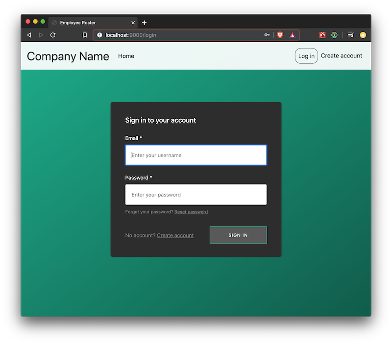
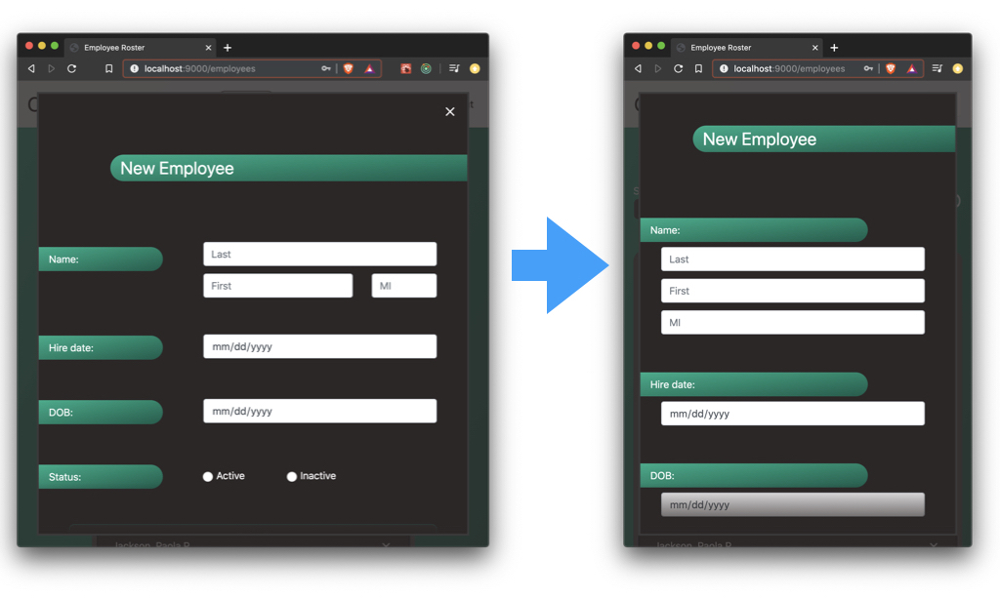

# Employee Roster App
Basic full-stack app implementing a Node.js RESTful API, React UI, front end routing, single-source-of-truth state management and 3rd-party authentication and authorization.

# Built with
| Tech              | Role                           |
|-------------------|--------------------------------|
| React             | UI                             |
| Redux             | State management               |
| React Router      | Front end routing              |
| React-Boostrap    | Styling components             |
| vanilla Bootstrap | Responsive styling             |
| vanilla CSS       | Styling                        |
| Webpack           | Bundler                        |
| Babel             | JSX transpiler                 |
| AWS Amplify       | Auth platform, user management |
| Amazon Cognito    | Secure back end resources      |
| Cognito-Express   | User verification middleware   |
| Node.js           | JS runtime env                 |
| Express           | Server framework               |
| Mongoose          | ODM library                    |
| MongoDB           | noSQL database                 |
| npm               | Package management             |

# UI

## Basic Features

<a href='https://youtu.be/amgjbuwtIhE' target="_blank">
  

    Tour basic features by video
  

  

    
  

</a>

- Login/signup/logout
- Tooltips
- Modals: confirm submit, successful data submission, wait-for-data, errors
- Uniform styling across modals

__________________________

  
## Responsive
<a href='https://youtu.be/eGvXd54dMis' target="_blank">
  

    See responsive UI by video
  

  

    
  

</a>

__________________________

## Form Validation
<a href='https://youtu.be/dSxuA-_tvjo' target="_blank">
  

    See form validation by video
  

  

    
  

</a>

- Fields validated onBlur
- Entire form validated onSubmit

__________________________

# High-level Auth & API Flow

